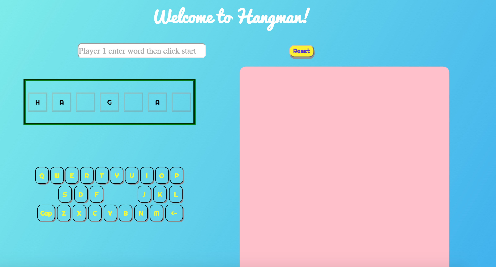

# Hangman game!  
<<<<<<< HEAD

### Dsescription of game
>The Hangman game have single player model and twin player model.  
>In single player model player should click the selcet bar and pick a category for word. The system would pick a random word from the category library. Then the player could use the artificial keyword to input character.  
>In twin-players model, player 1 would type the wordin the input box and click the start button right beside it. The text in the input box then would be hidden instantly. Then player 2 could start guess the word. Player 2 would have only ten chances. If the character is included in the word. The character would show up in the correct postion in that word.  
>Click reset button to restart the game!
=======

>At the begining of the Hangman game, player 1 would type the word(between 6-12 character) in an input box and click the button right beside it. The text in the input box then would be hidden instantly. Of course player 2 could not see the procees of typing. Then player 2 need to type one character in the same type each time or just guess the word directly. Player 2 would have only five chances. If the character is included in the word. The character would show up in the correct postion in that word. 
>>>>>>> gh-pages
____________

### Technologies used
>1. Using jquery selector to select the correct elements 
>2. Adding event listeners to inputs, buttons, divs, select bar  
>3. Looping through multi-tags and creating, modifying elements in DOM using jquery
>4. Using jcanvas to draw on canvas and control the animation.

### Unsolved problems
>If the hangman is **_not completed_** drawn(The player guessed the word), the reset button would response very, very slowly to the .removeLayer() method. I tried to use other methods such as .clearRect() or canvas.width = canvas.width, but those would have the same issues.

### Link to the game
[Online playable game click here ](https://yuli0109.github.io/project1/)